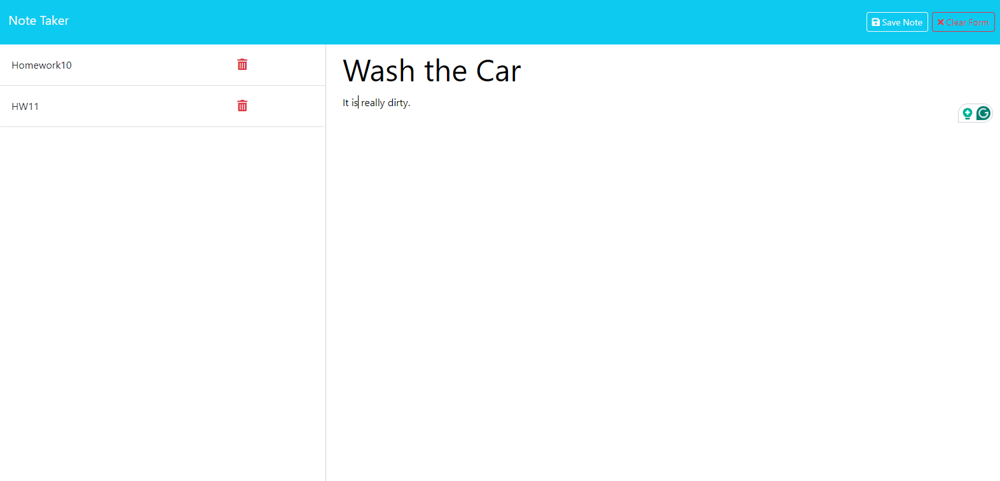
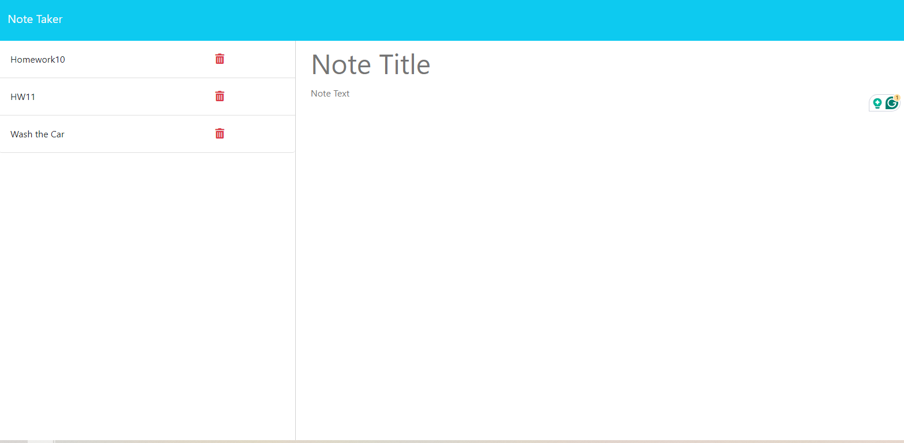
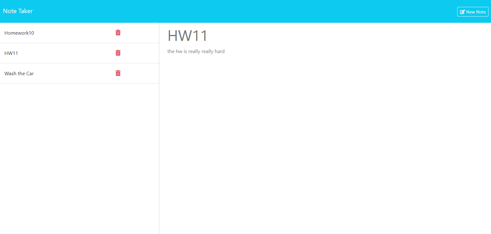

# Note Taker 
by Kendell Rennie
## Table of Contents 
- [Description](#description)
- [Installation](#installation)
- [Usage](#usage)
- [Tests](#tests)
- [License](#license)
- [Credits](#credits)
- [Questions](#questions)

## Description
Make a note taker that saves notes to a database.
## Installation
npm install
## Usage
Type the Notes
  
After you click save, you will see it the in the left

if you click an item on the left you will see the description 

## Credits
### Collaborators
Kendell Rennie  
  
### third-party-programs
fs  
uuid  
express  

## License
MIT
## Badges

## How to Contribute
If you like to contribute, my github username is dellman000

## Questions
If you have any questions, please contact me at kenren@udel.edu  
Link to my github profile page https://github.com/dellman000
 
    